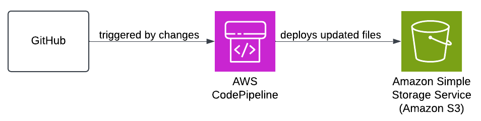

# CodePipeline and S3

This repository hosts a simple static website containing my resume. The website is automatically deployed to an Amazon S3 bucket through a CI/CD pipeline set up using AWS CodePipeline. This document outlines the pipeline architecture, setup steps, maintenance, and a feature list.

---

## 1. Pipeline Architecture

### Overview

The CI/CD pipeline is built using AWS CodePipeline to automate the deployment of changes from this GitHub repository to an S3 bucket configured for static website hosting. The pipeline is triggered whenever a code change is pushed to the `main` branch of the repository.

### Architecture Components

- **Source**: GitHub repository containing the static website files (`index.html`, `README.md`).
- **Pipeline Trigger**: A webhook from GitHub automatically triggers the pipeline on every push to the `main` branch.
- **Deploy Stage**: CodePipeline deploys the updated files to an S3 bucket, overwriting the existing content to reflect the latest changes on the website.

### Pipeline Diagram

---

## 2. Steps to Set Up and Configure the Pipeline

### Prerequisites

- An S3 bucket configured for **Static Website Hosting** with the public access policy enabled.
- A GitHub repository containing the static website files.

### Step-by-Step Setup Guide

#### Create an S3 Bucket

1. Go to **S3** in the AWS Console.
2. Create a new S3 bucket or use an existing one.
3. Enable **Static Website Hosting** in the bucket’s properties and configure permissions to allow public access.

#### Connect GitHub Repository to CodePipeline

1. In **AWS CodePipeline**, create a new pipeline and connect to your GitHub repository.
2. Authorize AWS to access your GitHub account.

#### Configure Pipeline Stages

- **Source Stage**: Set the source as GitHub and select your repository and branch (e.g., `main`). Choose "GitHub Webhooks" as the detection mode to automatically trigger the pipeline on changes.
- **Build Stage**: Not required for this static site, so this stage is skipped.
- **Deploy Stage**: Set the deploy provider to **Amazon S3** and choose your S3 bucket. Leave the "S3 Object Key" blank to deploy to the root, or specify a folder if needed.

#### Save and Run the Pipeline

1. Review the pipeline configuration and save it.
2. CodePipeline will now monitor the GitHub repository for changes and automatically deploy them to S3.

---

## 3. Maintenance and Troubleshooting

### Regular Maintenance

- **Monitor Pipeline Status**: Check the CodePipeline console regularly to monitor the status of each stage.
- **Update Bucket Permissions**: Ensure that the S3 bucket remains publicly accessible if updates are needed.
- **Update Pipeline Configuration**: Adjust the pipeline stages if new files or features are added to the website.

### Troubleshooting Tips

- **Access Denied Error on S3**: Verify that the S3 bucket policy allows public read access.
- **Pipeline Not Triggering**: Ensure the GitHub webhook is active, and GitHub is connected correctly in the pipeline.
- **Deployment Errors**: Check the logs in CodePipeline for details on any failed stages.

---

## 4. Feature List (Completed vs. Not Completed)

### Completed

- **Automated Deployment**: The pipeline automatically deploys any updates made to the `main` branch in the GitHub repository to the S3 bucket.
- **Static Website Hosting**: The website is hosted on S3 with public access, enabling direct access to the resume page.
- **CI/CD Pipeline Setup**: Configured AWS CodePipeline to trigger deployments from GitHub.
- **Documentation**: Comprehensive documentation for setup, maintenance, and presentation.
- **Demo**: Link has been provided in "Additional Information" section, at the bottom of this page.

### Not Completed

- **Build Stage**: Not included, as the project is a simple static website that doesn’t require compilation or building.
- **Automated Testing**: Not implemented, as the project doesn’t require tests for HTML and static content.
- **CloudWatch Monitoring**: Optional monitoring via CloudWatch was not set up, as it’s not essential for a static website deployment.

---

## 5. Additional Information

- **Static Website URL**: https://a4-comp4964.s3.us-west-2.amazonaws.com/website//index.html
- **GitHub Repository**: https://github.com/Ehsan138/COMP4964-A4
- **Link for the Demo**: 